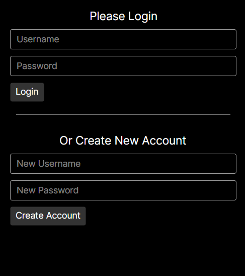
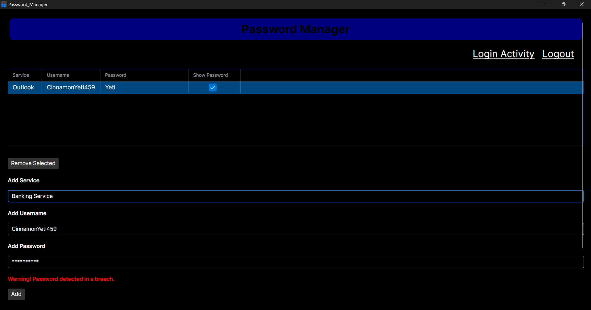
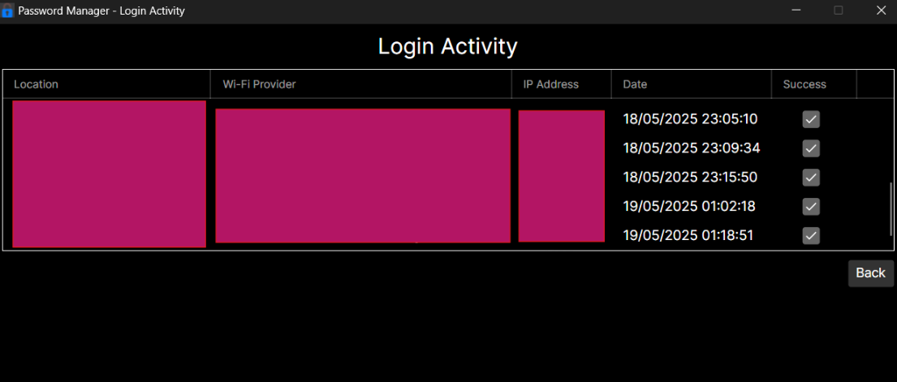

# Password Manager

A secure C# application with an Avalonia-based UI designed to keep your passwords safe and easily accessible — all while working completely offline.

## Features

- **Login and Create Account Screens**  
  Start by creating a secure account or logging in with your credentials to access your password database.

    

- **Breach Detection**  
  Uses a technique called k-Anonymity: the user’s password is hashed locally, and only the first 5 characters of the hash are sent to the Have I Been Pwned database. This allows checking if the password has been    exposed in a data breach without revealing the full password or full hash, while protecting user privacy.

  

- **Offline Functionality**  
  All your sensitive data is stored locally, so you don’t need an internet connection to manage your passwords.

- **Strong AES-256 Encryption**  
  Your data is encrypted using AES-256 with a unique key and initialization vector (IV) derived from a SHA-512 hash of your machine’s hardware ID (HWID). This ensures only your device can decrypt the data. (Subject To Change)

- **Password Database Management**  
  Add, edit, and securely store your services, usernames, and passwords. All entries are encrypted and saved securely on your machine.

- **Encrypted Storage**  
  Passwords and account data are stored encrypted, so they cannot be accessed without your login password or the encryption key.

- **Login Activity Tracking**  
  Monitor login attempts with details like Location, ISP, IP address, timestamp, and whether the login was successful or not.

    

- **Auto-Lock for Security**  
  The application automatically locks after 60 seconds of inactivity, preventing unauthorized access if you leave your computer unattended.

- **Password Generator**  
  Within the main page, there's a section just below where you'd enter your password to generate a complex one.

## TODO

- **Change the Encryption Method**  
  Currently, encryption uses AES-256 with a unique key and IV derived from a SHA-512 hash of your HWID. This will be updated to allow users to either enter their own encryption key or choose to have one generated   automatically.

- **Improve the Password Generator**  
  As of now, the password generator works, but there's no type of way to select a specific character pool, length and what type of characters to include or exclude, so this will be added in the future.

- **Require a Pin To Show Passwords**  
  Right now, once you’ve logged in successfully, anyone with access can unhide the stored passwords. To improve security, a user-chosen PIN will be required to view passwords.

- **Remember Name**  
  At the moment, you must enter your username every time you log in. Adding an option to remember your username would make logging in faster and more convenient.
